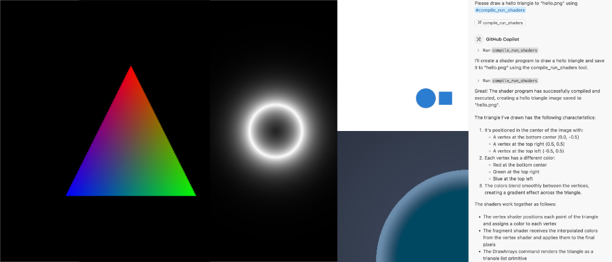

= `shaderc-vkrunner-mcp`
:toc:

A toy Model Context Protocol (MCP) server for AI agents to safely code, run, and visualize GPU shaders.

== Overview

`shaderc-vkrunner-mcp` provides a secure sandbox for AI agents to develop, compile, optimize, and run GPU shaders using Vulkan. It's designed to work entirely locally, making it compatible with self-hosted LLMs and AI tools that support the Model Context Protocol.

*Key Features:*

* Completely local execution - no additional API dependencies
* Support for shader compilation, optimization, and visualization
* Docker-based for easy deployment and isolation
* Tested with VS Code Copilot's Agent MCP
* Safe execution environment for AI-generated shader code - runs on CPU in a mostly isolated container without risking physical GPU crashes or lost devices

== Requirements

The only requirement to use `shaderc-vkrunner-mcp` is *Docker*, besides the MCP-capable AI Agent of your choice. The application is packaged as a Docker image with all necessary dependencies included.

== Quick Start

=== Installation

Although there are pre-built images in the GitHub Container Registry, it is easy to build the image from source:

[source,bash]
----
git clone https://github.com/mehmetoguzderin/shaderc-vkrunner-mcp
cd shaderc-vkrunner-mcp
docker build -t shaderc-vkrunner-mcp -f Dockerfile .
----

=== Connecting to MCP Clients

==== VS Code Copilot

Add this to your VS Code `mcp.json`:

[source,json]
----
"shaderc-vkrunner-mcp": {
    "type": "stdio",
    "command": "docker",
    "args": [
        "run",
        "--rm",
        "-i",
        "-v", "${workspaceFolder}:/work",
        "shaderc-vkrunner-mcp",
        "--work-dir",
        "/work"
    ]
}
----

Then you can reference it in your Copilot Chat using `#compile_run_shaders` tag in Agent mode.

==== Using with MCP Inspector

For debugging and testing, you can use the MCP Inspector:

[source,bash]
----
npx @modelcontextprotocol/inspector docker run -i --rm shaderc-vkrunner-mcp
----

== Architecture and Design

`shaderc-vkrunner-mcp` is built with several key design principles:

1. *Safety through CPU emulation*: Uses Mesa's software Vulkan implementation to run shaders on CPU, eliminating risks of GPU crashes, paravirtualization issues, or lost devices that typically create barriers for GPU programming
2. *Cross-platform compatibility*: Uses Vulkan instead of CUDA/OpenCL for broader hardware support while running entirely in software
3. *Minimal but helpful*: Enables testing advanced features like atomics, subgroups, cooperative matrices, and raytracing without physical GPU hardware
4. *Type-safe implementation*: Leverages Rust's strong typing system
5. *Monolithic design*: Provides a unified interface for shader development, optimization, and visualization

== Advanced Features

`shaderc-vkrunner-mcp` supports a wide range of Vulkan features that can be explored by AI agents, all running safely on CPU, including:

* *Subgroup operations*: For efficient parallel processing
* *Atomic operations*: For thread-safe memory operations

== Development

=== Development Environment

After cloning, it is also possible to use Devcontainer for a productive development experience. This environment includes everything needed to iterate on codebase with utilities for Vulkan, screenshotting virtual framebuffer, etc. and development of this repo was bascally done there. Even for non-development purposes, it is recommended to try the development environment.

=== Git Dependencies

The project adds VkRunner as a git subtree. This was done using:

[source,bash]
----
git subtree add --prefix vkrunner https://gitlab.freedesktop.org/mesa/vkrunner main --squash
----

This approach ensures that VkRunner is always available with the correct version, without requiring external dependencies.

=== Running Clippy

[source,bash]
----
cargo clippy -- \
    -W clippy::pedantic \
    -W clippy::nursery \
    -A clippy::missing-errors-doc \
    -A clippy::wildcard-imports \
    -A clippy::unused-self \
    -A clippy::unnecessary-wraps \
    -A clippy::needless-pass-by-value
----

== Contributing

Contributions are welcome! If you have improvements or bug fixes, please submit a pull request. If you encounter issues or have feature requests, please open an issue.

Some areas that could benefit from contributions:

* Improved documentation, examples, and testing
* Enhanced shader debugging capabilities
* Support for more Vulkan features
* Performance optimizations
* Better visualization tools

== License

This project is licensed under the Creative Commons CC0 1.0 Universal license. See the link:LICENSE[LICENSE] file for details.

Note that dependencies may have different licenses. Please check the respective repositories and directories for their licensing information.

== Acknowledgments

* link:https://modelcontextprotocol.io/[Model Context Protocol] for the MCP specification
* link:https://github.com/google/shaderc[Shaderc] for shader compilation
* link:https://gitlab.freedesktop.org/mesa/vkrunner[VkRunner] for shader execution (included as git subtree)
* link:https://www.mesa3d.org/[Mesa] for the software Vulkan implementation that enables GPU-less operation
