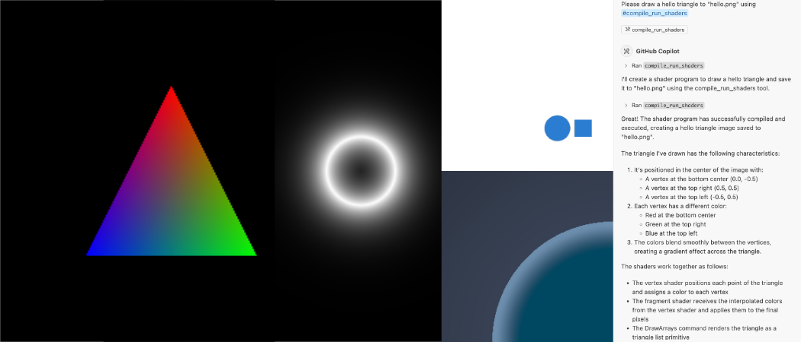

= `shaderc-vkrunner-mcp`
:toc:

A toy Model Context Protocol (MCP) server for AI agents to safely code, run, and visualize GPU shaders.

== Overview

`shaderc-vkrunner-mcp` provides a secure sandbox for AI agents to develop, compile, optimize, and run GPU shaders using Vulkan. It's designed to work entirely locally, making it compatible with self-hosted LLMs and AI tools that support the Model Context Protocol.

*Key Features:*

* Completely local execution - no additional API dependencies
* Support for shader compilation, optimization, and visualization
* Docker-based for easy deployment and isolation
* Tested with VS Code Copilot's Agent MCP
* Safe execution environment for AI-generated shader code - runs on CPU in a mostly isolated container without risking physical GPU crashes or lost devices

== Requirements

The only requirement to use `shaderc-vkrunner-mcp` is *Docker*, besides the MCP-capable AI Agent of your choice. The MCP server application is packaged as a Docker image with all necessary dependencies included.

== Quick Start

=== Installation

Although there are pre-built images in the GitHub Container Registry, it is easy to build the image from source:

[source,bash]
----
git clone https://github.com/mehmetoguzderin/shaderc-vkrunner-mcp
cd shaderc-vkrunner-mcp
docker build -t shaderc-vkrunner-mcp -f Dockerfile .
----

=== Connecting to MCP Clients

==== VS Code Copilot

Add this to your VS Code `mcp.json`:

[source,json]
----
"shaderc-vkrunner-mcp": {
    "type": "stdio",
    "command": "docker",
    "args": [
        "run",
        "--rm",
        "-i",
        "-v", "${workspaceFolder}:/work",
        "shaderc-vkrunner-mcp",
        "--work-dir",
        "/work"
    ]
}
----

Then you can reference it in your Copilot Chat using `#compile_run_shaders` tag in Agent mode.

==== Using with MCP Inspector

For debugging and testing, you can use the MCP Inspector:

[source,bash]
----
npx @modelcontextprotocol/inspector docker run -i --rm shaderc-vkrunner-mcp
----

[#display-forwarding]
== Interactive Display Forwarding (X11 and Waypipe)

By default the container is fully headless: it starts a virtual framebuffer (`Xvfb` on display `:99`) and renders shaders on the CPU, saving the results as images. This is all the MCP shader tool needs, and this default is unchanged.

If you want to *interact* with windowed apps that an agent builds and runs inside the container (for example `vkcube`, `glxgears`, or a custom Vulkan/OpenGL app), you can forward their windows to your host using either *X11 forwarding* or *Waypipe*.

The container auto-detects a forwarded display: when you pass a `DISPLAY` (X11) or `WAYLAND_DISPLAY` (Wayland/Waypipe) environment variable into the container, the internal `Xvfb` is skipped and the forwarded display is used instead. When neither is set, the headless `Xvfb :99` behavior is kept, so existing MCP usage is unaffected. `vulkan-tools` (`vkcube`), `mesa-utils` (`glxgears`), and `waypipe` are preinstalled in the image for this purpose.

NOTE: The same `-e DISPLAY` / `-v /tmp/.X11-unix:/tmp/.X11-unix` (or Waypipe) options can be added to the `docker run` args in your MCP client configuration if you want windows launched from the container to appear on your host while the MCP server is running.

=== X11 Forwarding (Linux host)

Share the host X11 socket and pass the `DISPLAY` variable.

Root container (the default user):

[source,bash]
----
# Allow local connections from the container's root user to your X server.
xhost +local:root

docker run --rm -it \
    -e DISPLAY="$DISPLAY" \
    -v /tmp/.X11-unix:/tmp/.X11-unix:rw \
    shaderc-vkrunner-mcp \
    vkcube

# Revoke the access grant when you are done.
xhost -local:root
----

Non-root container:

Run the container with your host user's UID/GID and grant access to that specific local user. Matching the UID lets the X server authorize the connection through the socket's peer credentials:

[source,bash]
----
xhost +SI:localuser:"$(id -un)"

docker run --rm -it \
    --user "$(id -u):$(id -g)" \
    -e DISPLAY="$DISPLAY" \
    -e XDG_RUNTIME_DIR=/tmp/xdg-runtime-dir \
    -v /tmp/.X11-unix:/tmp/.X11-unix:rw \
    shaderc-vkrunner-mcp \
    vkcube

xhost -SI:localuser:"$(id -un)"
----

If your X server relies on a cookie instead, also pass your authority file, for example `-e XAUTHORITY=/tmp/.Xauthority -v "$XAUTHORITY:/tmp/.Xauthority:ro"`.

TIP: `xhost +local:root` and `xhost +SI:localuser:...` relax X server access control. Prefer the narrowest rule that works, revoke it with `xhost -...` when finished, and avoid the broad `xhost +`.

=== Waypipe (Wayland host)

`waypipe` is preinstalled in the image. It serializes the Wayland protocol, so it works even when the host and container do not share the same GPU or driver. Connect the two ends through a shared socket bind mount.

[source,bash]
----
mkdir -p /tmp/waypipe

# On the host (real Wayland compositor): listen on the shared socket.
waypipe --socket /tmp/waypipe/comm.sock client &

# In the container: serve an app through the shared socket.
docker run --rm -it \
    -v /tmp/waypipe:/tmp/waypipe:rw \
    shaderc-vkrunner-mcp \
    waypipe --socket /tmp/waypipe/comm.sock server -- vkcube
----

`waypipe server` creates a Wayland display for the child app automatically, so you do not need to set `WAYLAND_DISPLAY` yourself. For a non-root container add `--user "$(id -u):$(id -g)"` and make sure `/tmp/waypipe` is writable by that user.

=== Direct Wayland Passthrough (optional)

If the host and container share the same GPU and architecture, you can skip Waypipe and mount the compositor socket directly. The container detects `WAYLAND_DISPLAY` and skips its internal `Xvfb`:

[source,bash]
----
docker run --rm -it \
    -e WAYLAND_DISPLAY="$WAYLAND_DISPLAY" \
    -e XDG_RUNTIME_DIR=/tmp/xdg-runtime-dir \
    -v "$XDG_RUNTIME_DIR/$WAYLAND_DISPLAY:/tmp/xdg-runtime-dir/$WAYLAND_DISPLAY:rw" \
    shaderc-vkrunner-mcp \
    vkcube
----

=== macOS and Windows hosts

On macOS, install an X server such as link:https://www.xquartz.org/[XQuartz], enable "Allow connections from network clients" in its preferences, run `xhost + 127.0.0.1`, and pass `-e DISPLAY=host.docker.internal:0` to `docker run`. On Windows, either run an X server (for example VcXsrv) with the same `DISPLAY=host.docker.internal:0.0` pattern, or use WSLg, which already provides `/tmp/.X11-unix` and a Wayland socket that can be mounted as shown in the Linux examples above.

=== SSH with forwarding

To drive the container from another machine, SSH into the host with forwarding enabled and then start the container with the recipes above:

* *X11*: `ssh -X host` (or `-Y` for trusted forwarding) sets `DISPLAY` on the host, so mounting `/tmp/.X11-unix` and passing `DISPLAY` into the container forwards windows all the way to your local machine.
* *Waypipe*: `waypipe` tunnels the Wayland protocol transparently over SSH (`waypipe ssh user@host -- <command>`), which pairs naturally with the containerized `waypipe ... server` command above.

== Architecture and Design

`shaderc-vkrunner-mcp` is built with several key design principles:

1. *Safety through CPU emulation*: Uses Mesa's software Vulkan implementation to run shaders on CPU, eliminating risks of GPU crashes, paravirtualization issues, or lost devices that typically create barriers for GPU programming
2. *Cross-platform compatibility*: Uses Vulkan instead of CUDA/OpenCL for broader hardware support while running entirely in software
3. *Minimal but helpful*: Enables testing advanced features like atomics, subgroups, cooperative matrices, and raytracing without physical GPU hardware
4. *Type-safe implementation*: Leverages Rust's strong typing system
5. *Monolithic design*: Provides a unified interface for shader development, optimization, and visualization

== Advanced Features

`shaderc-vkrunner-mcp` supports a wide range of Vulkan features that can be explored by AI agents, all running safely on CPU, including:

* *Subgroup operations*: For efficient parallel processing
* *Atomic operations*: For thread-safe memory operations

== Development

=== Development Environment

After cloning, it is also possible to use Devcontainer for a productive development experience. This environment includes everything needed to iterate on codebase with utilities for Vulkan, screenshotting virtual framebuffer, etc. and development of this repo was bascally done there. Even for non-development purposes, it is recommended to try the development environment.

The devcontainer is headless by default, but it can forward windows to your host. See <<display-forwarding>> for the details; `.devcontainer/docker-compose.yml` contains commented mounts to enable X11 forwarding.

=== Git Dependencies

The project adds VkRunner as a git subtree. This was done using:

[source,bash]
----
git subtree add --prefix vkrunner https://gitlab.freedesktop.org/mesa/vkrunner main --squash
----

This approach ensures that VkRunner is always available with the correct version, without requiring external dependencies.

=== Running Clippy

[source,bash]
----
cargo clippy -- \
    -W clippy::pedantic \
    -W clippy::nursery \
    -A clippy::missing-errors-doc \
    -A clippy::wildcard-imports \
    -A clippy::unused-self \
    -A clippy::unnecessary-wraps \
    -A clippy::needless-pass-by-value
----

== Contributing

Contributions are welcome! If you have improvements or bug fixes, please submit a pull request. If you encounter issues or have feature requests, please open an issue.

Some areas that could benefit from contributions:

* Improved documentation, examples, and testing
* Enhanced shader debugging capabilities
* Support for more Vulkan features
* Performance optimizations
* Better visualization tools

== License

This project is licensed under the Creative Commons CC0 1.0 Universal license. See the link:LICENSE[LICENSE] file for details.

Note that dependencies may have different licenses. Please check the respective repositories and directories for their licensing information.

== Acknowledgments

* link:https://modelcontextprotocol.io/[Model Context Protocol] for the MCP specification
* link:https://github.com/google/shaderc[Shaderc] for shader compilation
* link:https://gitlab.freedesktop.org/mesa/vkrunner[VkRunner] for shader execution (included as git subtree)
* link:https://www.mesa3d.org/[Mesa] for the software Vulkan implementation that enables GPU-less operation
